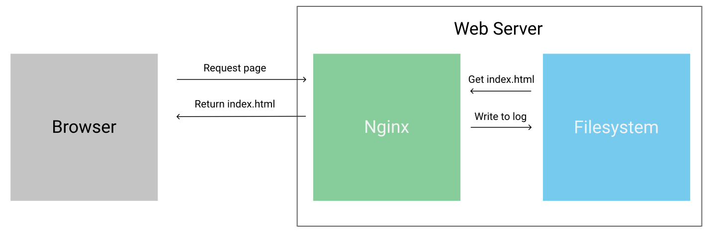

# Web Log Pipeline
A small pipeline analyzing mocked web logs.

## Background Reading

A common use case for a data pipeline is figuring out information about the visitors to your web site. If you’re familiar with Google Analytics, you know the value of seeing real-time and historical information on visitors. Our data pipeline will use data from web server logs to answer questions about website visitors. 

If you’re unfamiliar, every time you visit a web page, your browser is sent data from a web server. In this example pipeline, we use a high-performance web server called Nginx. Here’s how the process of you typing in a URL and seeing a result works:

The process of sending a request from a web browser to a server works follows:

First, the client sends a request to the web server asking for a certain page. The web server then loads the page from the filesystem and returns it to the client. As it serves the request, the web server writes a line to a log file on the filesystem that contains some metadata about the client and the request. This log enables someone to later see who visited which pages on the website at what time, and perform other analysis.

A typical line from the Nginx log could look like this:
X.X.X.X - - [09/Mar/2017:01:15:59 +0000] "GET /blog/assets/css/jupyter.css HTTP/1.1" 200 30294 "http://www.dataquest.io/blog/" "Mozilla/5.0 (X11; Linux x86_64) AppleWebKit/537.36 (KHTML, like Gecko) Ubuntu Chromium/53.0.2785.143 Chrome/53.0.2785.143 Safari/537.36 PingdomPageSpeed/1.0 (pingbot/2.0; +http://www.pingdom.com/)"

Each request is a single line, and lines are appended in chronological order, as requests are made to the server. The format of each line is the Nginx combined format, below are some descriptions of each variable in this format:

* remote_addr: the ip address of the client making the request to the server.
* remote_user: if the client authenticated with basic authentication, this is the user name.
* time_local: the local time when the request was made. For instance 09/Mar/2017:01:15:59 +0000
* request: the type of request, and the URL that it was made to. For instance GET /blog/assets/css/jupyter.css HTTP/1.1
* status: the response status code from the server.
* body_bytes_sent: the number of bytes sent by the server to the client in the response body.
* http_referrer: the page that the client was on before sending the current request.
* http_user_agent: information about the browser and system of the client

As you can imagine, companies derive a lot of value from knowing which visitors are on their site, and what they’re doing. For example, realizing that users who use the Google Chrome browser rarely visit a certain page may indicate that the page has a rendering issue in that browser.
Another example is in knowing how many users from each district visit your site each day. It can help you figure out which district to focus your marketing efforts on. At the simplest level, just knowing how many visitors you have per day can help you understand if your marketing efforts are working properly. In order to calculate these metrics, we need to parse the log files and analyze them. And to do this, we need to construct a data pipeline.

